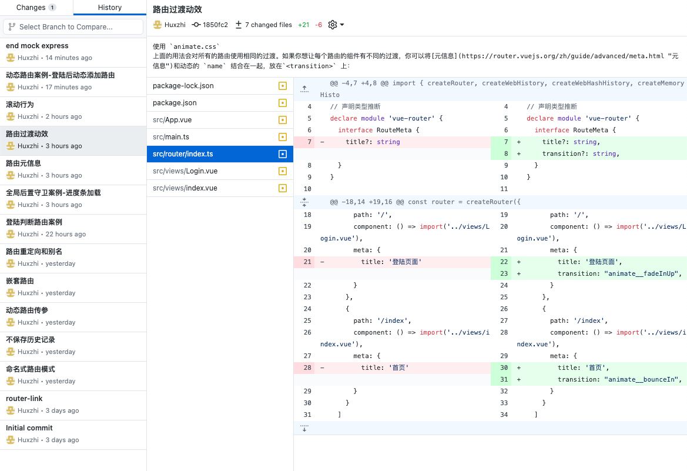

# 小满Router教学

跟着小满zs 的 [CSDN文章](https://blog.csdn.net/qq1195566313/category_11696205.html) 和 [B站视频](https://www.bilibili.com/video/BV1dS4y1y7vd?p=77) 学习，所记下的笔记和代码，供自己思考和查询

0. [什么是路由](doc/00-什么是路由.md)
1. [安装](doc/01-安装.md)
2. [路由跳转方式](doc/02-路由跳转方式.md)
3. [不保存历史记录](doc/03-不保存历史记录.md)
4. [路由传参](doc/04-路由传参.md)
5. [嵌套路由](doc/05-嵌套路由.md)
6. [命名视图](doc/06-命名视图.md)
7. [重定向-别名](doc/07-重定向-别名.md)
8. [导航守卫](doc/08-导航守卫.md)
   1. [全局前置守卫案例-登陆判断路由](doc/08.a-全局前置守卫案例-登陆判断路由.md)
   2. [全局后置守卫案例-进度条加载](doc/08.b-全局后置守卫案例-进度条加载.md)
9.  [路由元信息](doc/09-路由元信息.md)
10. [路由过渡动效](doc/10-路由过渡动效.md)
11. [滚动行为](doc/11-滚动行为.md)
12. [动态路由](doc/12-动态路由.md)
    1.  [动态路由案例-登陆后动态添加路由](doc/12.a-动态路由案例-登陆后动态添加路由.md)
    2.  模拟后端发送数据代码在 `end-mock-express`

- 文章 
  - 部分修改，增加了一些个人补充说明，和运行代码时遇到的BUG
  - 遵循 CC 4.0 BY-SA 版权协议，转载附上原文出处链接和声明。
- 代码 
  - **代码可运行** 根据文章结构进行分次 commit ，清晰展现实现不同功能的代码差异、方便回顾
  - 使用技巧
    - 在对应的 commit 右键 new branch ，创建分支，然后切换到新的分支， 就可以运行代码了
  - 

我学习的时间为 2023-01-13，小满的教程为 2022-03-27，要是能早点遇到满哥就好了，现在跟随满哥的步伐，认真学习技术

