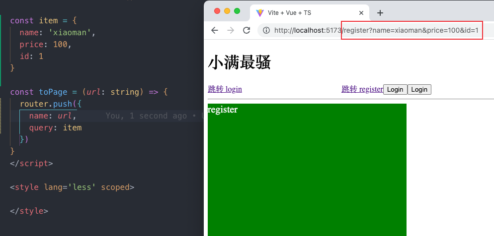

> [!NOTE] Important Note
> 在 8 月份之后的 vue 中，若不把 params 参数写在路由路径中将不会在组件中得到 params 参数，所以说现在 params 参数也会显示在地址栏上了。不是弃用 params。  
> [https://github.com/vuejs/router/blob/main/packages/router/CHANGELOG.md#414](https://github.com/vuejs/router/blob/main/packages/router/CHANGELOG.md#414)-2022-08-22

## Query 路由传参

### 传递参数

编程式导航 使用 router push 或者 replace 的时候 改为对象形式新增 query 必须传入一个对象，会将 query 对象展示在 路由路径(url) 上

```js
const toDetail = (item: Item) => {
    router.push({
        path: '/reg',
        query: item
    })
}
```



### 接受参数

使用 useRoute 的 query

```js
import { useRoute } from 'vue-router';
const route = useRoute()
```

```vue
 <div>品牌：{{ route.query?.name }}</div>
 <div>价格：{{ route.query?.price }}</div>
 <div>ID：{{ route.query?.id }}</div>
```

## Params 路由传参

编程式导航 使用 router push 或者 replace 的时候 改为对象形式并且只能使用 name，path 无效，然后传入 params

```ts
const toDetail = (item: Item) => {
    router.push({
        name: 'Reg',
        params: item
    })
}
```

接受参数

使用 useRoute 的 params

```js
import { useRoute } from 'vue-router';
const route = useRoute()
```

```vue
<div>品牌：{{ route.params?.name }}</div>
<div>价格：{{ route.params?.price }}</div>
<div>ID：{{ route.params?.id }}</div>
```

## 动态路由传参

很多时候，我们需要将给定匹配模式的路由映射到同一个组件。
例如，我们可能有一个 User 组件，它应该对所有用户进行渲染，但用户 ID 不同。
在 Vue Router 中，我们可以在路径中使用一个动态字段来实现，我们称之为 路径参数

**路径参数 用冒号 : 表示。当一个路由被匹配时，它的 params 的值将在每个组件**

```ts
const routes:Array<RouteRecordRaw> = [
    {
        path:"/",
        name:"Login",
        component:()=> import('../components/login.vue')
    },
    {
        //动态路由参数
        path:"/reg/:id",
        name:"Reg",
        component:()=> import('../components/reg.vue')
    }
]
```

```ts
const toDetail = (item: Item) => {
    router.push({
        name: 'Reg',
        params: {
            id: item.id
        }
    })
}
```

```js
import { useRoute } from 'vue-router';
import { data } from './list.json'
const route = useRoute()


const item = data.find(v => v.id === Number(route.params.id))
```

## 二者的区别

1. query 传参配置的是 path，而 params 传参配置的是 name，在 params 中配置 path 无效
2. query 在路由配置不需要设置参数，而 params 必须设置
3. query 传递的参数会显示在地址栏中
4. params 传参刷新会无效，但是 query 会保存传递过来的值，刷新不变 ;
5. 路由配置

> 版权声明：本文为博主原创文章，遵循 CC 4.0 BY-SA 版权协议，转载请附上原文出处链接和本声明。
> 本文链接：https://blog.csdn.net/qq1195566313/article/details/123613595