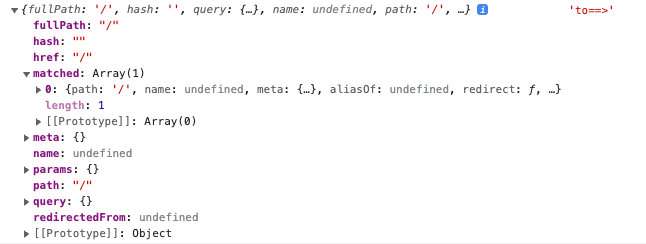

# 重定向 redirect

接收 3 种形式的参数

```ts
/**
 * Route Location that can infer the possible paths.
 *
 * @internal
 */
export declare interface RouteLocationPathRaw extends RouteQueryAndHash, MatcherLocationAsPath, RouteLocationOptions {
}

/**
 * User-level route location
 */
export declare type RouteLocationRaw = string | RouteLocationPathRaw | RouteLocationNamedRaw;

```

## 1.字符串形式配置

访问/ 重定向到 /user （地址栏显示/,内容为/user 路由的内容）

```ts
const routes: Array<RouteRecordRaw> = [
    {
        path:'/',
        component:()=> import('../components/root.vue'),
        redirect:'/user1',
        children:[
            {
                path:'/user1',
                components:{
                    default:()=> import('../components/A.vue')
                }
            },
            {
                path:'/user2',
                components:{
                    bbb:()=> import('../components/B.vue'),
                    ccc:()=> import('../components/C.vue')
                }
            }
        ]
    }
]
```

## 2.对象形式配置

```ts
const routes: Array<RouteRecordRaw> = [
{
    path: '/',
    component: () => import('../components/root.vue'),
    redirect: { path: '/user1' }, //name: 'user'
    children: [
        {
            path: '/user1',
            components: {
                default: () => import('../components/A.vue')
            }
        },
        {
            path: '/user2',
            components: {
                bbb: () => import('../components/B.vue'),
                ccc: () => import('../components/C.vue')
            }
        }
    ]
}
]

```

## 3.函数模式（可以传参）

```ts
const routes: Array<RouteRecordRaw> = [
    {
        path: '/',
        component: () => import('../components/root.vue'),
        redirect: (to) => {
            return {
                path: '/user1',
                query: to.query //将父级参数传递
            }
        },
        children: [
            {
                path: '/user1',
                components: {
                    default: () => import('../components/A.vue')
                }
            },
            {
                path: '/user2',
                components: {
                    bbb: () => import('../components/B.vue'),
                    ccc: () => import('../components/C.vue')
                }
            }
        ]
    }
]
```

#### to 对象的内容

查看 to `console.log(to, 'to==>');`



# 别名  alias

将  `/`  别名为  `/root`，意味着当用户访问  `/root`时，URL 仍然是  `/user`，但会被匹配为用户正在访问  `/`

```ts
const routes: Array<RouteRecordRaw> = [
    {
        path: '/',
        component: () => import('../components/root.vue'),
        alias:["/root","/root2","/root3"],
        children: [
            {
                path: 'user1',
                components: {
                    default: () => import('../components/A.vue')
                }
            },
            {
                path: 'user2',
                components: {
                    bbb: () => import('../components/B.vue'),
                    ccc: () => import('../components/C.vue')
                }
            }
        ]
    }
]
```

> 版权声明：本文为博主原创文章，遵循 CC 4.0 BY-SA 版权协议，转载请附上原文出处链接和本声明。
> 本文链接：https://blog.csdn.net/qq1195566313/article/details/123697904